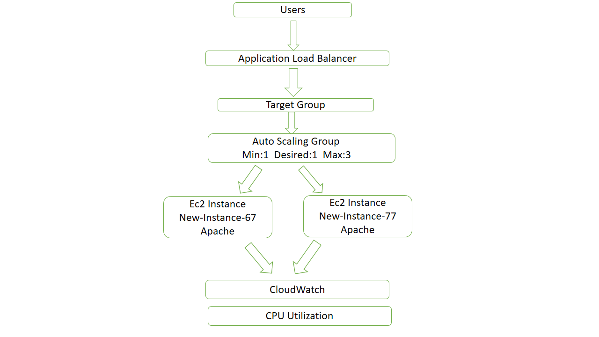

#### &#x20;    **AWS Auto Scaling with Application Load Balancer (ALB)**

* ##### **Project Overview**

**This project demonstrates how to manage and maintain web server traffic using an AWS Application Load Balancer (ALB) and Auto Scaling Group (ASG).**

**The Auto Scaling Group automatically launches additional EC2 instances when CPU utilization increases and terminates them when the load decreases. The Load Balancer distributes incoming traffic across healthy instances.**

* ##### &#x20;**Architecture**

* ##### &#x20;**AWS Services Used**

1. &#x20;**Amazon EC2**
2. &#x20;**Launch Template**
3. &#x20;**Auto Scaling Group (ASG)**
4. &#x20;**Application Load Balancer (ALB)**
5. &#x20;**Target Group**
6. &#x20;**Amazon CloudWatch**

**7.  Security Group**

* ##### &#x20;**Project Workflow**

1. **Created a Launch Template with the required EC2 configuration.**
2. **Configured an Auto Scaling Group using the Launch Template.**
3. **Defined Minimum, Desired, and Maximum Capacity.**
4. **Created an Application Load Balancer.**
5. **Configured a Target Group and attached it to the Load Balancer.**
6. **Linked the Auto Scaling Group with the Target Group.**
7. **Monitored CPU utilization using CloudWatch.**
8. **Generated CPU load on running instances.**
9. **Verified automatic scaling based on CPU utilization.**

* ##### **Screenshots**

1. &#x20;**Launch Template**

**This launch template was used to define the EC2 instance configuration, including AMI, instance type, security group, and user data script.**

**2. Auto Scaling Group**

**The Auto Scaling Group was configured with minimum, desired, and maximum capacity to automatically manage EC2 instances based on workload.**

**3. Load Balancer**

**The Application Load Balancer distributes incoming traffic across healthy EC2 instances to improve availability and reliability.**

**4. Target Group**

**The target group contains the EC2 instances registered behind the load balancer and performs health checks on them.**

**5.  CPU Utilization**

**CPU load was generated on the EC2 instance to test the auto scaling functionality and trigger scaling actions.**

**6. Auto Scaled Instance**

**A new EC2 instance was automatically launched when CPU utilization exceeded the configured threshold.**

* ##### &#x20;**User Data Script**

**The user-data file is a script which was used to automatically install and configure the Apache web server during instance launch.**

* ##### **Testing Commands**

**bash**

**systemctl status httpd (# if it shows in active then systemctl start httpd).**

**top**

**sha1sum /dev/zero**

* ##### **Results**
1. **Successfully distributed traffic using Application Load Balancer.**
2. **Automatically launched new EC2 instances when CPU utilization increased.**
3. **Improved application availability and fault tolerance.**
4. **Demonstrated dynamic infrastructure scaling using AWS Auto Scaling.**

* ##### **Repository**

**This project demonstrates practical implementation of AWS scaling and load balancing concepts used in production cloud environments.**

